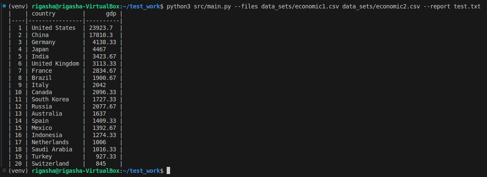
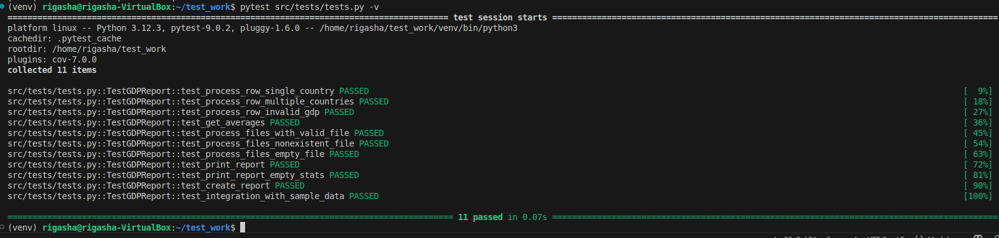
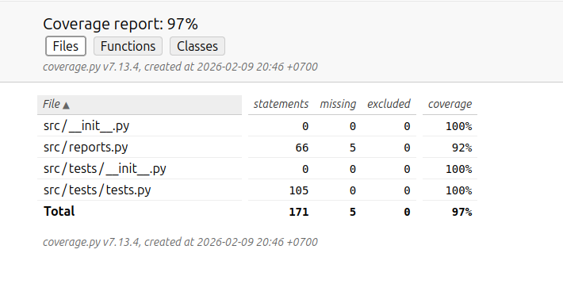

# Generation Report for GDP
    Генерация отчета о среднем ВВП страны на основе данных, предоставленых в файле csv-формата.

## Структура проекта
    Проект состоит из базового класса генерации отчета(src/report.py), от которого мы можем наследоваться и реализовывать нужные логику отчета. В нашем случае для среднего значения ВВП страны.  
    Скрипт принимает два аргумента *--file* - обрабатываемые файлы, --report - название выходного файла отчета

    Примеры запуска скрипты  *python3 test.py --files economic1.csv economic2.csv --report test.txt*  
      
    *Выполнение скрипта*

    - Варианты для добавления новых отчетов:
        - Создание нового отчета путем наследования от базового класса.
        - Релактирование файлы *main.py*

## Установка

    - Для установки нужно подготовить виртуальное окржение.  
        - python -m venv venv
        - source venv/bin/activate
    - Установка зависимостей
        - pip install -r req.txt

## Тесты

    - Предоставлены тесты проверки функционала программы.
        - Запуск тестов: pytest src/tests/tests.py -v  
          
        *Результат тестов*

    - Отчет с результатами о покрытии.
        - Для получения отчета необходимо выполнить скрипт из корневой директории *coverage.sh*  
          
        *Отчет о покрытии*  

        